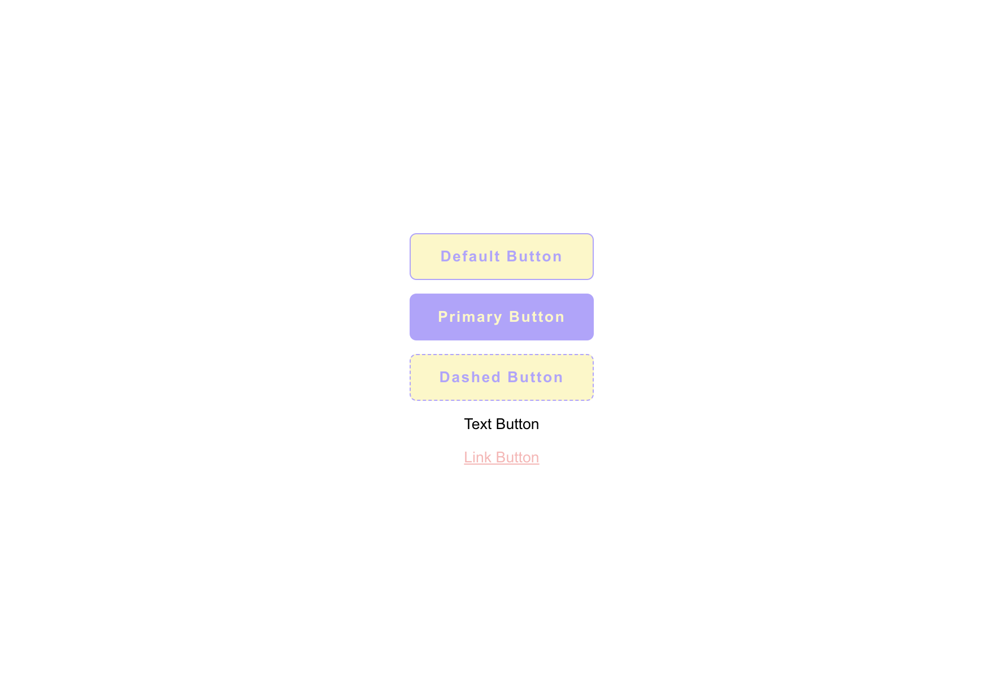

# buttoni

> &quot;patika.dev&quot; Button publishing project

[](https://www.npmjs.com/package/buttoni) [](https://standardjs.com)

## Install

```bash
npm install --save buttoni
```

## Usage



```jsx
import React from 'react'

import { Button } from 'buttoni'
import 'buttoni/dist/index.css'

class Example extends Component {
  render() {
    return (
      <div>
        <Button>Default Button</Button>
        <Button type='primary'>Primary Button</Button>
        <Button type='dashed'>Dashed Button</Button>
        <Button type='text'>Text Button</Button>
        <Button type='link'>Link Button</Button>
      </div>
    )
  }
}
```

## License

MIT © [godricpursue](https://github.com/godricpursue)
